class: primary
```{r setup, echo = F, cache = F, include = F}
library(magrittr)
library(tidyverse)
library(ggplot2)
library(keras)
library(furrr)
plan(multicore)
mytheme <- theme_bw() + 
  theme(panel.grid.major = element_line(color = "grey50"),
        panel.grid.minor = element_line(color = "grey60"))
theme_set(mytheme)
knitr::opts_chunk$set(echo = FALSE, message = F, warning = F, 
                      cache = T, dpi = 300, dev = 'png')
source("../code/Generate_Model_Images.R")
```

```{r load_refs, echo=FALSE, cache=FALSE, include = F, eval = F}
library(RefManageR)
BibOptions(check.entries = FALSE, 
           bib.style = "numeric", 
           cite.style = 'authoryear', 
           style = "html",
           hyperlink = FALSE, 
           no.print.fields = c("isbn", "urldate"),
           dashed = FALSE)
bb <- ReadBib("./refs.bib", check = T)
```

```{r unicode}
# Unicode symbols for classes
unicode_symbols <- c(bowtie = "",
  star = "\u2605",
  polygon = "\u2B23",
  chevron = "\uFE3D",
  triangle = "\u25BC",
  other = "\u003F",
  circle =  "\u23FA",
  text = "a",
  quad = "\u25A0",
  line = "\u2225"
  )
unicode_symbols <- tibble(labels = names(unicode_symbols),
                              shape = as.character(unicode_symbols))
classes <- c("bowtie", "chevron", "circle", "line", "polygon", "quad", "star", 
             "text", "triangle")
```

```{r labeled_data}
model_path <- "../model/TrainedModels"
newest_model <- get_newest(dir = model_path, pattern = "weights.h5")
newest_data_file <- file.path("../model/RProcessedImages", newest_model$process_dir, "cropped_photos.Rdata")
load(newest_data_file)

source("../code/count_images.R")
```

```{r load-keras-model}
library(keras)
model_dir <- newest_model$path
load(list.files(model_dir, "-history.Rdata", full.names = T)[1])
#load(file.path(get_newest()$path, get_newest(pattern = "\\d.Rdata")$base_file))
load(file.path(get_newest(dir = "../model/TrainedModels")$path, 
               get_newest(dir = "../model/TrainedModels", 
                          pattern = "\\d.Rdata")$base_file))
```

## Estimating Random Match Probability

1. Define the comparison population

2. Sample from the comparison population    
$N$ total shoes

3. Identify similar shoes from the comparison population    
$S$ similar shoes in the $N$ shoe sample

4. Estimate the probability of a coincidental match: $$\hat{p} = \frac{S}{N}$$

--
<br/>

> .large[Quantifying the frequency of shoes in a local population is an unsolveable problem]<br/> - Leslie Hammer, [Hammer Forensics](https://hammerforensics.com/), March 2018


---
class:primary

## Outsole Class Characteristics

- Make, model, tread pattern, size, shoe type

- Cannot be used for identification of an individual

- Used for exclusion


---
class:primary
## Relevant Features

Use features other than make/model and size to characterize shoes

- Knockoffs often have very similar tread patterns
- Similar styles have similar tread patterns across brands
- Unknown shoes can still be classified and assessed

| Dr. Martens | Eastland | Timberland |
| --- | --- | --- |
| 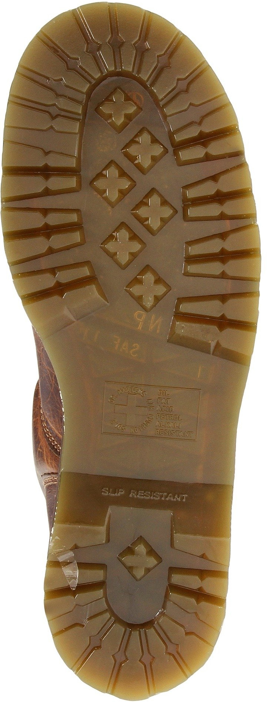 | 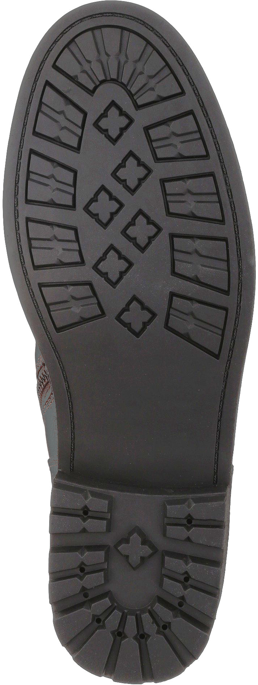 | 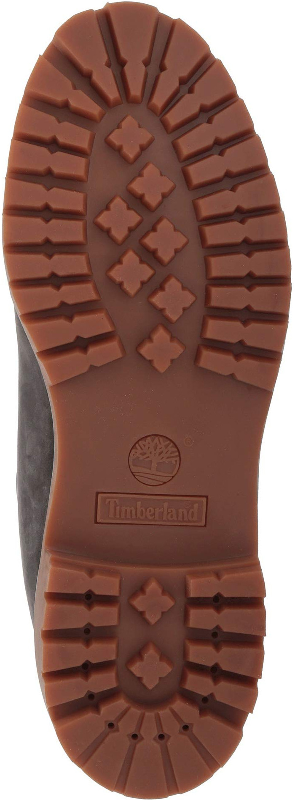 |
| Work 2295 Rigger | 1955 Edition Jett | 6" Premium Boot |

---
class:primary

## Computational Image Analysis

- Crime scene information comes as images, so this is an image analysis problem

- Classical methods exist (e.g., Hough transform, primitive feature detection), but they work on small scales and are not robust.

- Want method that predicts quickly and accurately, and produces interpretable features


---
class:primary

## Human Vision

Brief overview of feature detectors

---
class:primary

## Human Classification

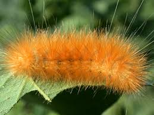 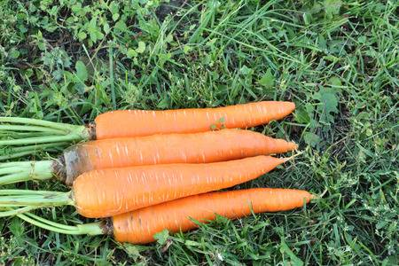

---
class:primary

## Human Classification

```{r}
source(file.path(codedir, "Generate_Model_Images.R"))
col_vec <- rep("grey50", 32)
col_vec[seq(1, 29, by = 4)] <- rep(c("blue", "orange"), 4)

lty <- rep("solid", 32)
lty[c(21,25)] <- "dashed"

plot <- plot_deepviz2(c(4,2), edge_col = col_vec, line_type = lty)

df <- data.frame(x = plot$data$x,
                 y = plot$data$y,
                 labs = c("Orange", "Long", "Fuzzy", "Pointy",
                          "Caterpillar", "Carrot"))

plot + geom_label(aes(x = x, y = y, label = labs), data = df)

```


---
class: primary
## CNN architecture

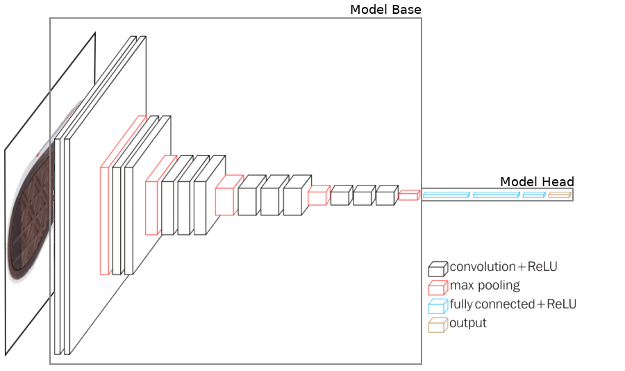

---
class: primary
## Image Convolution

Let $x$ be an image represented as a numerical matrix, indexed by $i, j$, and $\beta$ be a filter of dimension $(2a + 1) \times (2b + 1)$

The convolution of image $x$ and filter $\beta$ is $$(\beta \ast x)(i, j) = \sum_{s = -a}^a\sum_{t = -b}^b \beta(s, t) x(i-s, j-t)$$


---
class: primary
## Convolutional Layers

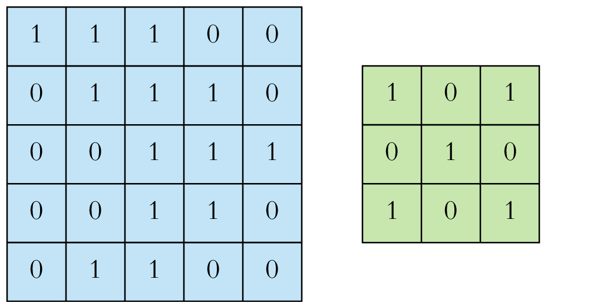

.pull-left[.center[Input image 
$\displaystyle x$
]]
.pull-right[.center[
Weight matrix
$\displaystyle \mathbf{\beta}$
]]

.footer[Image source: https://towardsdatascience.com/applied-deep-learning-part-4-convolutional-neural-networks-584bc134c1e2]


---
class: primary
## Convolutional Layers

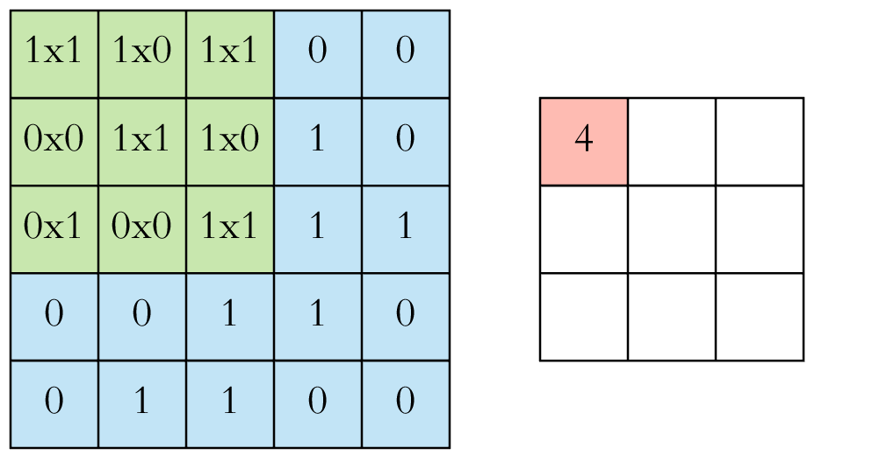

.pull-left[.center[Convolution: 
$\displaystyle \beta\ast x$
]]
.pull-right[.center[
Feature Map
$(\beta \ast x)(i, j)$
]]

.footer[Image source: https://towardsdatascience.com/applied-deep-learning-part-4-convolutional-neural-networks-584bc134c1e2]


---
class: primary
## Convolutional Layers

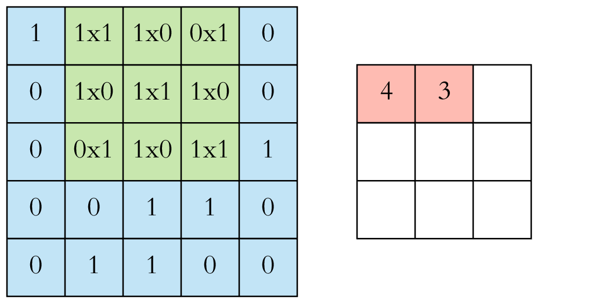

.pull-left[.center[Convolution: 
$\displaystyle \beta\ast x$
]]
.pull-right[.center[
Feature Map
$(\beta \ast x)(i, j)$
]]

.footer[Image source: https://towardsdatascience.com/applied-deep-learning-part-4-convolutional-neural-networks-584bc134c1e2]


---
class:primary

## Convolutional Neural Networks

---
class:primary
## Fully connected

```{r fully-connected, out.width = "75%", fig.width = 6, fig.height = 4, fig.align = "center"}
plot_deepviz_arrows(c(6, 6, 3), r = .1)
```
---
class:primary
# Dropout

```{r dropout, out.width = "75%", fig.width = 6, fig.height = 4, fig.align = "center"}
plot_deepviz_dropout(n = c(6,6,3), rm_nodes = c(3,4,6,8,10,11), cross_out = T)
```


---
class:primary
# Geometric Features


| Bowtie | Chevron | Circle |
| ------ | ------- | ------ |
| 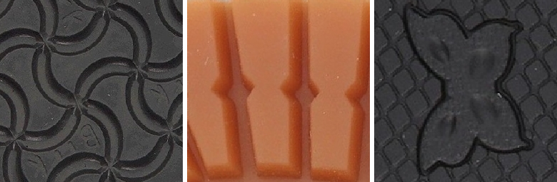 | 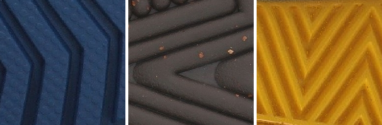 | 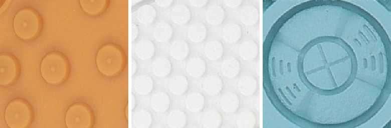 |

| Line | Polygon | Quadrilateral |
| ---- | ------- | ---- |
| 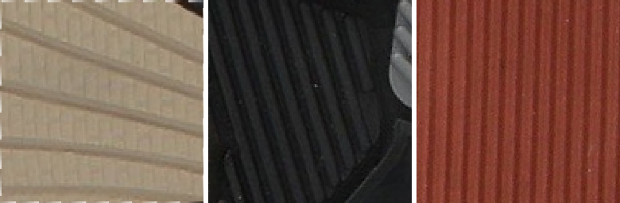 | 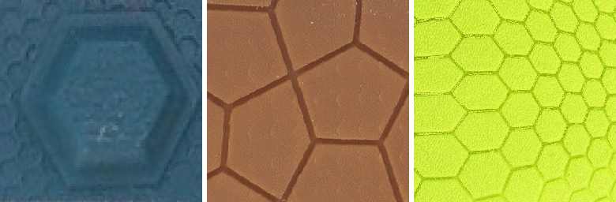 | 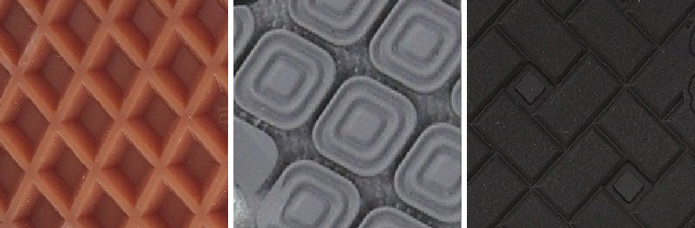 |

| Star | Text | Triangle |
| ---- | ---- | -------- |
| 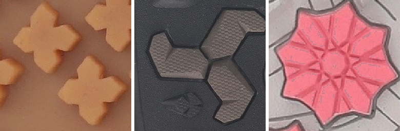 | 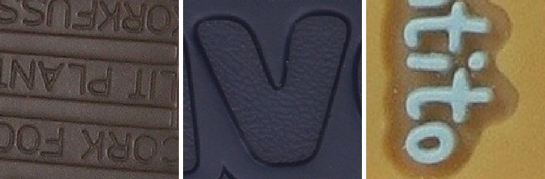 | 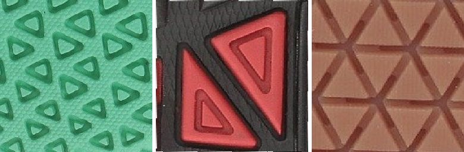 |


---
class:primary

# Data

- To date, `r unique(ann_df$base_image) %>% length()` shoes have been labeled, yielding `r nrow(dfunion)` multi-label images.

```{r class-characteristic-barchart, fig.width = 5.5, fig.height = 3.75, out.width = "90%", dpi = 300, fig.cap = "Distribution of classes in all labeled images. Quadrilaterals, lines, circles, text, and chevrons are relatively common; stars, polygons, and bowties are relatively uncommon."}
annotated_imgs %>%
  mutate(label_type = str_replace(label_type, "multi", "multiple")) %>%
  mutate(labels = str_to_title(labels)) %>%
  mutate(labels = factor(labels, levels = c("Quad", "Line", "Text", "Circle",
                                            "Chevron", "Triangle", "Polygon",
                                            "Star", "Bowtie", "Other"))) %>%
  ggplot() +
  geom_bar(aes(x = labels, fill = label_type), color = "black") +
  scale_fill_manual("Labels", values = c("single" = "#6ba2b9",
                                         "multiple" = "#2e5597")) +
  coord_flip() +
  ylab("# Labeled Images") +
  xlab("")  +
  ggtitle("Current Class Distribution (All Labeled Images)") +
  mytheme +
  theme(legend.position = c(1, 1),
        legend.justification = c(1.03, 1.03),
        legend.background = element_rect(fill = "white"))

```

---
class:primary

# VGG16

---
class:primary

# Data

---
class:primary

# Model Training

---
class:primary

# ROC

---
class:primary

# Confusion Matrix

---
class:primary

# Model Consistency

---
class:primary

#Heatmaps

---
class:primary

# Conclusion
