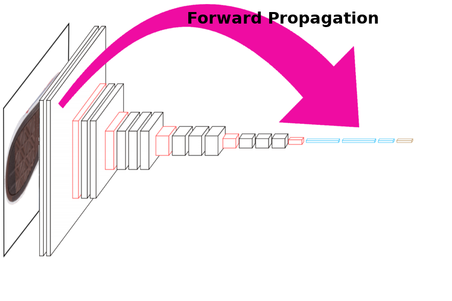
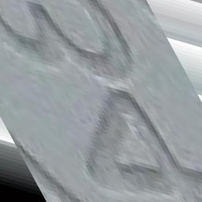
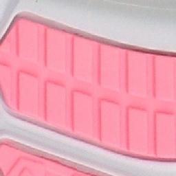
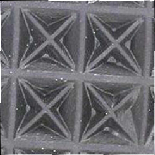
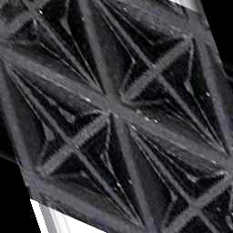
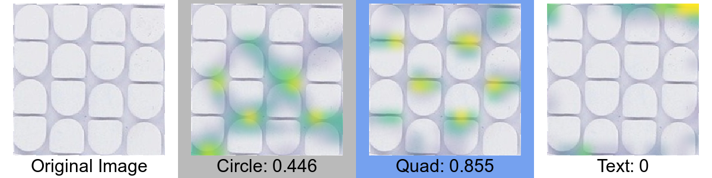

class: primary
```{r setup, echo = F, cache = F, include = F}
library(magrittr)
library(tidyverse)
library(ggplot2)
library(keras)
library(furrr)
plan(multicore)
mytheme <- theme_bw() + 
  theme(panel.grid.major = element_line(color = "grey50"),
        panel.grid.minor = element_line(color = "grey60"))
theme_set(mytheme)
knitr::opts_chunk$set(echo = FALSE, message = F, warning = F, 
                      cache = T, dpi = 300, dev = 'png', 
                      fig.width = 8, fig.height = 6)
source("../code/Generate_Model_Images.R")
```

```{r load_refs, echo=FALSE, cache=FALSE, include = F, eval = F}
library(RefManageR)
BibOptions(check.entries = FALSE, 
           bib.style = "numeric", 
           cite.style = 'authoryear', 
           style = "html",
           hyperlink = FALSE, 
           no.print.fields = c("isbn", "urldate"),
           dashed = FALSE)
bb <- ReadBib("./refs.bib", check = T)
```

```{r unicode}
# Unicode symbols for classes
unicode_symbols <- c(bowtie = "",
  star = "\u2605",
  polygon = "\u2B23",
  chevron = "\uFE3D",
  triangle = "\u25BC",
  other = "\u003F",
  circle =  "\u23FA",
  text = "a",
  quad = "\u25A0",
  line = "\u2225"
  )
unicode_symbols <- tibble(labels = names(unicode_symbols),
                              shape = as.character(unicode_symbols))
classes <- c("bowtie", "chevron", "circle", "line", "polygon", "quad", "star", 
             "text", "triangle")
```

```{r labeled_data}
model_path <- "../model/TrainedModels"
newest_model <- get_newest(dir = model_path, pattern = "weights.h5")
newest_data_file <- file.path("../model/RProcessedImages", newest_model$process_dir, "cropped_photos.Rdata")
load(newest_data_file)

source("../code/count_images.R")
```

```{r load-keras-model, cache = F}
library(keras)
model_dir <- newest_model$path
load(list.files(model_dir, "-history.Rdata", full.names = T)[1])
#load(file.path(get_newest()$path, get_newest(pattern = "\\d.Rdata")$base_file))
load(file.path(get_newest(dir = "../model/TrainedModels")$path, 
               get_newest(dir = "../model/TrainedModels", 
                          pattern = "\\d.Rdata")$base_file))

model_wts_file <- file.path(newest_model$path, newest_model$base_file)
loaded_model <- set_weights(model_wts_file)
```

## Estimating Random Match Probability

1. Define the comparison population

2. Sample from the comparison population    
$N$ total shoes

3. Identify similar shoes from the comparison population    
$S$ similar shoes in the $N$ shoe sample

4. Estimate the probability of a coincidental match: $$\hat{p} = \frac{S}{N}$$

--
<br/>

> .large[Quantifying the frequency of shoes in a local population is an unsolveable problem]<br/> - Leslie Hammer, [Hammer Forensics](https://hammerforensics.com/), March 2018


---
class:primary

## Relevant Features

Use features other than make/model and size to characterize shoes

- Knockoffs often have very similar tread patterns
- Similar styles have similar tread patterns across brands
- Unknown shoes can still be classified and assessed

| Dr. Martens | Eastland | Timberland |
| --- | --- | --- |
|  |  |  |
| Work 2295 Rigger | 1955 Edition Jett | 6" Premium Boot |

---
class:primary

## Computational Image <br/> Analysis

- Crime scene information comes as images, so this is an image analysis problem<br/><br/>
- Classical methods exist (e.g., Hough transform, primitive feature detection), but they work on small scales and are not robust.<br/><br/>
- Want a method that predicts quickly and accurately, and produces interpretable features


---
class:primary

## Human Classification

.center[ ]

---
class:primary

## Human Classification

```{r carrot-caterpillar-nodes, fig.height = 2.5, fig.width = 4, out.width = "100%", fig.align = "center"}
col_vec <- rep("grey50", 32)
col_vec[seq(1, 29, by = 4)] <- rep(c("blue", "orange"), 4)

lty <- rep("solid", 32)
lty[c(21,25)] <- "dashed"

plot <- plot_deepviz2(c(4,2), edge_col = col_vec, line_type = lty)

df <- data.frame(x = plot$data$x,
                 y = plot$data$y,
                 labs = c("Orange", "Long", "Fuzzy", "Pointy",
                          "Caterpillar", "Carrot"))
 
plot + geom_label(aes(x = x, y = y, label = labs), data = df)

```


---
class: primary
## CNN Architecture


---
class: primary
## Image Convolution

Let $x$ be an image represented as a numerical matrix, indexed by $i, j$, and $\beta$ be a filter of dimension $(2a + 1) \times (2b + 1)$

The convolution of image $x$ and filter $\beta$ is $$(\beta \ast x)(i, j) = \sum_{s = -a}^a\sum_{t = -b}^b \beta(s, t) x(i-s, j-t)$$


---
class: primary
## Convolutional Layers


.pull-left[.center[Input image 
$\displaystyle x$
]]
.pull-right[.center[
Weight matrix
$\displaystyle \mathbf{\beta}$
]]

.footer[Image source: https://towardsdatascience.com/applied-deep-learning-part-4-convolutional-neural-networks-584bc134c1e2]


---
class: primary
## Convolutional Layers


.pull-left[.center[Convolution: 
$\displaystyle \beta\ast x$
]]
.pull-right[.center[
Feature Map
$(\beta \ast x)(i, j)$
]]

.footer[Image source: https://towardsdatascience.com/applied-deep-learning-part-4-convolutional-neural-networks-584bc134c1e2]


---
class: primary
## Convolutional Layers


.pull-left[.center[Convolution: 
$\displaystyle \beta\ast x$
]]
.pull-right[.center[
Feature Map
$(\beta \ast x)(i, j)$
]]

.footer[Image source: https://towardsdatascience.com/applied-deep-learning-part-4-convolutional-neural-networks-584bc134c1e2]


---
class:primary
## Activation Functions

```{r activation-functions, fig.width = 4, fig.height = 3, out.width = "90%"}
sigmoid <- function(x) 1/(1 + exp(-x))
relu <- function(x) pmax(x, 0)
elu <- function(x, a) a*(exp(x) - 1) * (x < 0) + x * (x > 0)
softplus <- function(x) log(1 + exp(x))

x <- seq(-3, 3, .005)
tibble(x = x, Linear = x, Sigmoid = sigmoid(x),
       ReLU = relu(x), ELU = elu(x, 1), SoftPlus = softplus(x)) %>%
  gather(key = key, value = value, -x) %>%
  mutate(key = factor(key, levels = c("Linear", "ReLU", "ELU",
                                      "SoftPlus", "Sigmoid"))) %>%
  ggplot(aes(x = x, y = value)) + geom_line() + facet_wrap(.~key) +
  ggtitle("Common Activation Functions") +
  theme(axis.title = element_blank()) +
  coord_fixed()
```


---
class:primary

## Max Pooling 


$$\begin{align} p\left(x, f, w, s\right) =& \text{ matrix-wise pooling on matrix } x \text{ with function } f, \\
& \text{ with window } w, \text{ and stride } s
\end{align}$$


---
class:primary
## Densely Connected Layers

```{r densely-connected, out.width = "75%", fig.width = 10, fig.height = 8, fig.align = "center"}
#plot_deepviz_arrows(c(6, 6, 3), r = .1)
plot_deepviz_arrows(c(12, 9, 4), r = .1)
```

---
class:primary
## Dropout

```{r dropout, out.width = "75%", fig.width = 10, fig.height = 8, fig.align = "center"}
#plot_deepviz_dropout(n = c(6,6,3), rm_nodes = c(3,4,6,8,10,11), cross_out = T)
set.seed(2)
plot_deepviz_dropout(n = c(12,9,4), rm_nodes = c(sample(2:11, 5), sample(14:20, 4)), cross_out = T)
```


---
class: primary
## CNN Architecture


---
class: primary
## Forward Propogation

- The process by which an input image moves through the layers of the network<br/>

\begin{align}
x^{(\ell)}_k &= \sigma^\ell\left({\beta^\ell_k}\ast x^{(\ell-1)} + \gamma^\ell\right) \text{ for convolution} \\
x^{(\ell)}_k &= p\left(x^{(\ell-1)}, \max, s, s\right) \text{ for max pooling layers}\nonumber \\
x^{(\ell)}_k &= \sigma^\ell\left(Wx^{(\ell-1)} + \gamma^\ell\right) \text{ for densely connected layers}\nonumber
\end{align}

```{r, fig.height = 4, fig.width = 6, out.width = "50%", fig.align = "center"}

```

---
class: primary
## Binary Cross-Entropy Loss

- For a single input image $x^{(0)}$ with true labels $\textbf{y} \in \left\{0,1\right\}^C$ and prediction $\mathbf{p} \in [0,1]^C$,<br/>

\begin{align}
L(\mathbf{y}, \mathbf{p}) &= \sum_{i=1}^C -\left[y_i \log(p_i) + (1 - y_i)\log(1-p_i) \right]
\end{align}

```{r, fig.height = 2.5, fig.width = 5, out.width = "80%", fig.align = "center"}
L <- function(y, p) -(y * log(p) + (1-y)*log(1-p))
p <- seq(.01, 1, .01)

tibble(p = p, Loss = L(0, p)) %>%
  ggplot(aes(x = p, y = Loss)) + geom_line() +
  ggtitle("Single Class Loss for Y = 0") 

```

---
class: primary
## Backward Propogation

- The process by which a network "learns"

\begin{align}
\left(\frac{\partial L}{\partial \beta^\ell_k}\right) &= \underbrace{\frac{\partial L}{\partial \left(\beta^\ell_k \ast x^{\ell - 1}\right)}}_\text{gradient} x^{\ell-1}\\
\frac{\partial L}{\partial \left(\beta^\ell_k \ast x^{\ell - 1}\right)} &= \frac{\partial L}{\partial x^\ell} \left[\sigma'\left(\beta^\ell_k \ast x^{\ell - 1}\right)\right]\nonumber
\end{align}

```{r, fig.height = 4, fig.width = 6, out.width = "50%", fig.align = "center"}
knitr::include_graphics("images/vgg16-shoe-backward-propagation.png")
```

---
class: primary
## Parameter Space

- Convolutional base: ~14.5 million parameters <br/><br/>
- Simple model head (9 output classes): ~8.4 million parameters <br/><br/>
- Total parameter space: ~22.9 million <br/><br/>
- Estimated model optimization time: 2-3 weeks with 4 GPUs <br/>
- Data requirements: > 1 million labeled images <br/><br/>

--

<br/><br/>

.large[.center[We have <27.5k labeled images]]


---
class: primary
## Transfer learning

- Use weights from a model trained on different input data <br/><br/>
- Train a new model head with one hidden layer of 256 nodes and 9 output nodes <br/><br/>
- Total parameter space: 8.4 million <br/><br/>
- Model optimization time: <3 hours <br/><br/>

--

#### VGG16
- Pre-trained CNN (Simonyan, et al., 2014) <br/><br/> 
    - Trained on 1.3 million images from ImageNet (Krizhevsky, et al., 2012) <br/><br/> 
    - Simple structure


---
class:primary
## Geometric Features


| Bowtie | Chevron | Circle |
| ------ | ------- | ------ |
|  |  |  |

| Line | Polygon | Quadrilateral |
| ---- | ------- | ---- |
|  |  |  |

| Star | Text | Triangle |
| ---- | ---- | -------- |
|  |  |  |


---
class:primary

## Data Collection

 

---
class:primary

## Data Collection


---
class:primary

## Data

- To date, `r unique(ann_df$base_image) %>% length()` shoes have been labeled, yielding `r nrow(dfunion)` multi-label images.
- 60/20/20 data split for train/validation/test

```{r class-characteristic-barchart, fig.width = 5.5, fig.height = 3.75, out.width = "80%", dpi = 300, fig.align = "center"}
annotated_imgs %>%
  mutate(label_type = str_replace(label_type, "multi", "multiple")) %>%
  mutate(labels = str_to_title(labels)) %>%
  mutate(labels = factor(labels, levels = c("Quad", "Line", "Text", "Circle",
                                            "Chevron", "Triangle", "Polygon",
                                            "Star", "Bowtie", "Other"))) %>%
  ggplot() +
  geom_bar(aes(x = labels, fill = label_type), color = "black") +
  scale_fill_manual("Labels", values = c("single" = "#6ba2b9",
                                         "multiple" = "#2e5597")) +
  coord_flip() +
  ylab("# Labeled Images") +
  xlab("")  +
  ggtitle("Current Class Distribution (All Labeled Images)") +
  mytheme +
  theme(legend.position = c(1, 1),
        legend.justification = c(1.03, 1.03),
        legend.background = element_rect(fill = "white"))

```


---
class:primary

## Model Training

- 256 x 256 pixel images <br/><br/>
- Training data (60%): <br/><br/>
    - 1x Augmented images (rotation, skew, zoom, crop) to prevent overfitting<br/><br/>
    - Class weights used to counteract uneven class sizes <br/><br/>
- Validation and test data (20% each)<br/><br/>
- Fit using the `keras` package in R, which provides a high-level API for the `tensorflow` library

<div class="move-margin">
 
 
  
 
</div>


---
class:primary

## Model Training

```{r training-accuracy, out.width = "90%"}
data.frame(history$metrics) %>%
  mutate(epoch = 1:n()) %>%
  gather(key = "measure", value = "value", -epoch) %>%
  mutate(Type = ifelse(str_detect(measure, "val"), "Validation", "Training"),
         measure = ifelse(str_detect(measure, "acc"), "Accuracy", "Loss")) %>%
  # bind_rows(tibble(epoch = NA, value =  .6, measure = "Accuracy", Type = "Validation")) %>%
  # bind_rows(tibble(epoch = NA, value =  .33, measure = "Loss", Type = "Validation")) %>%
  ggplot(aes(x = epoch, y = value, color = Type)) +
  geom_point() +
  geom_smooth(se = F) +
  facet_grid(measure~., scales = "free_y", switch = "both") +
  theme_bw() +
  scale_y_continuous("") +
  scale_x_continuous("Epoch") +
  ggtitle("CoNNOR Training Performance") + mytheme +
  theme(axis.title.y = element_blank(), legend.position = c(1, .5),
        legend.justification = c(1.03, -0.05),
        legend.background = element_rect(fill = "white"))
```

---
class:primary

## Whole Model ROC

```{r whole-model-roc, out.width = "100%", fig.width = 7, fig.height = 4.375}
library(pROC)
pred_df <- as_tibble(preds) %>% gather(key = feature, value = value)
test_labs_df <- as_tibble(test_labs) %>% gather(key = feature, value = value)
whole_model_roc <- roc(test_labs_df$value, pred_df$value)

whole_model_roc_df <- tibble(tpr = whole_model_roc$sensitivities,
                             fpr = 1 - whole_model_roc$specificities,
                             thresholds = whole_model_roc$thresholds,
                             auc = whole_model_roc$auc[1]) %>%
  nest(tpr, fpr, thresholds, .key =  "roc_plot") %>%
  mutate(eer = purrr::map(roc_plot, eer))
ggplot() +
  geom_line(aes(x = fpr, y = tpr), data = unnest(whole_model_roc_df, roc_plot), size = 1.25) +
  geom_label(aes(x = 1, y = .07, label = sprintf("AUC: %0.2f", auc)), hjust = 1, vjust = -0.2, data = whole_model_roc_df) +
  geom_point(aes(x = fpr, y = tpr, color = "Equal Error Rate"), data = unnest(whole_model_roc_df, eer), size = 2) +
  scale_color_manual("", values = "black") +
  scale_x_continuous("False Positive Rate", breaks = c(0, .25, .5, .75, 1), labels = c("0.0", "", "0.5", "", "1.0")) +
  scale_y_continuous("True Positive Rate", breaks = c(0, .25, .5, .75, 1), labels = c("0.0", "", "0.5", "", "1.0")) +
  ggtitle("CoNNOR Test Set Performance (All Classes)") +
  coord_fixed() + mytheme +
  theme(legend.position = c(1, 0), legend.justification = c(1.01, -0.01), legend.title = element_blank(), legend.background = element_rect(fill = "white"))

```

---
class:primary

## ROC by Class

```{r class-roc, fig.width = 7.5, fig.height = 5, out.width = "99%"}
aucs <- plot_onehot_roc(preds, test_labs, str_to_title(classes))
thresholds <- purrr::map_dbl(aucs$data$eer, ~.$thresholds)
aucs$data$thresholds <- thresholds

ggplot() +
  geom_line(aes(x = fpr, y = tpr), data = unnest(aucs$data, roc_plot), size = 1.25) +
  geom_label(aes(x = 1, y = 0, label = sprintf("AUC: %0.2f\nEER: %0.2f", auc, thresholds)), hjust = 1, vjust = -0.02, data = aucs$data) +
  geom_point(aes(x = fpr, y = tpr, color = "Equal Error\nRate (EER)"), data = unnest(aucs$data, eer), size = 2.5) +
  scale_color_manual("", values = "black") +
  facet_wrap(~class) +
  scale_x_continuous("False Positive Rate", breaks = c(0, .25, .5, .75, 1), labels = c("0.0", "", "0.5", "", "1.0")) +
  scale_y_continuous("True Positive Rate", breaks = c(0, .25, .5, .75, 1), labels = c("0.0", "", "0.5", "", "1.0")) +
  ggtitle("CoNNOR Test Set Performance") +
  facet_wrap(~class, nrow = 2) +
  coord_fixed() +
  theme(legend.position = c(1, 0), legend.justification = c(1, 0))
```


---
class:primary

## Confusion Matrix

```{r confusion-matrix, fig.width = 7.5, fig.height = 6.5, out.width = "80%"}
get_confusion_matrix(predictions = preds, classes = classes,
                     test_labels = test_labs, threshold = thresholds) %>%
  set_names(str_to_title(classes)) %>%
  ggcorrplot(., hc.order = F, outline.col = "white", lab = T) +
  scale_fill_gradient("Classification\nRate", low = "white",
                      high = "cornflowerblue", limits = c(0, 1)) +
  scale_x_discrete("Image Label") + scale_y_discrete("Prediction") +
  theme(axis.title.x = element_text(size = 14),
        axis.title.y = element_text(size = 14, angle = 90, vjust = 1)) +
  ggtitle("CoNNOR Multi-Class Confusion Matrix: Test Set Performance") +
  theme_bw() +
  theme(panel.grid.major = element_line(color = "grey50"),
        panel.grid.minor = element_line(color = "grey60")) +
  theme(plot.margin = grid::unit(c(0,0,0,0), "mm"),
        plot.background = element_rect(fill = "transparent", color = NA),
        plot.subtitle = element_blank(), plot.caption = element_blank(),
        panel.spacing = unit(c(0, 0, 0, 0), "mm"))


```

---
class:primary
## Model Consistency
.nudge-up[
```{r generic-chevron, fig.width = 7.33, fig.height = 4, out.width = "100%", dpi = 600}
chevron2 <- list.files(here::here("Presentation", "images", "generic-chevron"), full.names = T)
pred_prob_plot(chevron2, loaded_model)
```
]


---
class:primary
## Model Consistency
.nudge-up[
```{r text-line, fig.width = 7.33, fig.height = 4, out.width = "100%", dpi = 600}
text <- list.files(here::here("Presentation", "images", "generic-text-line"), full.names = T)
pred_prob_plot(text, loaded_model)
```
]

---
class:primary
## Model Consistency
.nudge-up[
```{r uggs, fig.width = 7.33, fig.height = 5.33, out.width = "100%", dpi = 600, class.output='move-up'}
ugg <- list.files(here::here("Presentation", "images", "ugg-circle-star-logo"), full.names = T)
pred_prob_plot(ugg, loaded_model, sort = F)
```
]

---
class:primary
## Model Consistency
.nudge-up[
```{r fix-contrast, fig.width = 7.33, fig.height = 5.33, out.width = "100%", dpi = 600, class.output='move-up'}
lc <- list.files(here::here("Presentation", "images", "low-contrast"), full.names = T)
pred_prob_plot(lc, loaded_model, sort = F)
```
]

---
class:primary

## Class Activation Maps

```{r out.width = "95%", fig.width = 8, fig.height = 6}
heatmaps <- list.files("../figure/chapter3/", pattern = "^heatmap", full.names = T)
knitr::include_graphics(heatmaps[grepl("chevron-circle", heatmaps)])
knitr::include_graphics(heatmaps[grepl("text", heatmaps)])
```

<br/>
Heatmaps are scaled by class. Yellow = high activation

.move-margin[<br/><br/>Blue: Prediction matches image label <br/><br/>Grey: Prediction does not match image label]


---
class:primary

## Class Activation Maps

```{r out.width = "95%", fig.width = 8, fig.height = 6}
heatmaps <- list.files("../figure/chapter3/", pattern = "^heatmap", full.names = T)
knitr::include_graphics(heatmaps[grepl("star-quad", heatmaps)])
knitr::include_graphics(heatmaps[grepl("quad-triangle-polygon", heatmaps)])
```

<br/>
Heatmaps are scaled by class. Yellow = high activation

.move-margin[<br/><br/>Blue: Prediction matches image label <br/><br/>Grey: Prediction does not match image label]

---
class:primary

## Class Activation Maps

```{r out.width = "95%", fig.width = 8, fig.height = 6}
heatmaps <- list.files("../figure/chapter3/", pattern = "^heatmap", full.names = T)
knitr::include_graphics(heatmaps[grepl("corks", heatmaps)])
knitr::include_graphics(heatmaps[grepl("bowtie-star", heatmaps)])
```

<br/>
Heatmaps are scaled by class. Yellow = high activation

.move-margin[<br/><br/>Blue: Prediction matches image label <br/><br/>Grey: Prediction does not match image label]


---
class:primary

## Class Activation Maps

```{r out.width = "95%", fig.width = 8, fig.height = 6}
heatmaps <- list.files("../figure/chapter3/", pattern = "^heatmap", full.names = T)
knitr::include_graphics("images/heatmap-test_image.png")

```

<br/>
Heatmaps are scaled by class. Yellow = high activation

.move-margin[<br/><br/>Blue: Prediction matches image label <br/><br/>Grey: Prediction does not match image label]


---
class:primary

## Future Work

- Image color-correction to reduce effect of contrast <br/><br/>
- Explore texture/color segmentation to reduce effect of color <br/><br/>
- Compare prediction without final convolutional block <br/><br/>
- Integrate spatial information for whole-shoe predictions <br/><br/>
  - Split shoe into pieces and predict individually <br/><br/>
  - Train a Fully Convolutional Network (FCN) and fit model to aggregate features <br/><br/>


